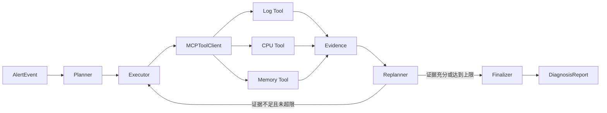

# Intelligent OnCall Agent System

> 基于 LangGraph + MCP 的智能运维告警诊断系统

基于 LangGraph + MCP 构建的智能 OnCall 运维 Agent 系统，通过 Planner、Executor、Replanner 工作流串联告警解析、日志与监控工具调用、根因分析及处置建议生成。

> 本仓库使用本地模拟告警、日志和监控数据进行工程验证，未接入任何企业内部系统；评测结果不代表真实生产环境表现。

## 项目解决什么问题

传统告警处理通常需要运维人员在日志平台、监控平台和知识库之间反复切换。本项目把排查过程拆成可观察的状态流：先制定计划，再按步骤调用工具收集证据，证据不足时重新规划，最后输出带证据的根因判断与处置建议。

核心关注点不是“让模型自由发挥”，而是让诊断过程具备明确状态、有限循环、失败降级和可评测结果。

## 架构



一次诊断的状态主要包括告警、排查计划、当前步骤、工具证据、重规划轮次和最终报告。节点只返回状态更新；条件边负责决定继续执行、重新规划或结束。

## 关键设计

### 1. Plan-Execute-Replan

- **Planner**：根据告警类型生成日志、CPU或内存查询步骤。
- **Executor**：逐步调用 MCP 工具，把结构化结果写入证据集合。
- **Replanner**：检查证据数量和质量；不足时补充新的工具步骤，并限制最大诊断轮次。
- **Finalizer**：根据证据输出根因、置信度、建议和是否需要人工介入。

### 2. 稳定的工具调用

`MCPToolClient` 为所有工具提供一致的调用边界：

- 使用 `asyncio.wait_for` 控制单次调用超时；
- 对超时和临时错误执行有限次数的指数退避重试；
- 参数错误、响应字段缺失等永久错误不重试；
- 所有结果统一转换为 `ToolEvidence`，记录来源、时间戳、尝试次数和错误信息。

### 3. 工具与推理解耦

FastMCP 服务只负责输入校验和数据查询，LangGraph 工作流只消费结构化证据。将模拟工具替换为 CLS、Prometheus 或其他监控平台时，不需要改写工作流控制逻辑。

## 目录结构

```text
aiops-oncall-agent/
├── README.md
├── pyproject.toml
├── src/oncall_agent/
│   ├── models.py          # 告警、步骤、证据、报告和图状态
│   ├── mcp_client.py      # 超时、重试、错误分类和传输接口
│   ├── mcp_server.py      # 日志、CPU、内存 FastMCP 工具
│   ├── workflow.py        # LangGraph Plan-Execute-Replan 工作流
│   ├── evaluation.py      # 评测指标计算
│   └── data/sample_incidents.json
└── tests/
    ├── test_mcp_client.py
    ├── test_workflow.py
    └── test_evaluation.py
```

## 本地检查

项目不需要大模型 API Key。安装依赖并运行测试：

```bash
python -m venv .venv

# Windows PowerShell
.venv\Scripts\Activate.ps1

python -m pip install -e ".[dev]"
pytest -q
```

如需检查 MCP 工具注册是否正常，可启动本地 stdio 服务：

```bash
python -m oncall_agent.mcp_server
```

## 模拟评测

评测集按高 CPU、高内存、错误率上升等 12 类告警场景构造。任务完成需要满足：工作流在最大轮次内结束、至少获得两条有效证据、输出根因和处置建议。

| 指标 | 计算口径 | 本地模拟结果 |
|---|---|---:|
| 端到端任务完成率 | 51 / 60 | 85.0% |
| 工具成功率（无重试） | 135 / 150 | 90.0% |
| 工具成功率（开启重试） | 146 / 150 | 97.3% |

这里的“约 97%”来自 `146 / 150 = 97.3%`。仓库中的评测模块只负责可复现地计算指标；样本数字用于说明简历中的评测口径，不应解释为线上 SLA。

## 关键取舍

- 使用规则推理器代替外部 LLM，使测试结果确定且不依赖密钥。
- 保留 LangGraph 和 FastMCP 的真实接口，突出状态编排与工具契约。
- 设置最大诊断轮次，避免 Agent 在证据不足时无限循环。
- 报告可以降级为低置信度并请求人工介入，不强行生成确定结论。

## 已知限制

- 模拟工具不具备真实监控平台的查询语法、权限控制和数据规模。
- 规则推理器只覆盖少量典型告警，不代表通用根因分析能力。
- 未实现持久化会话、成本统计、链路追踪和前端展示。

后续可将 `ToolTransport` 替换为真实 MCP 客户端，引入大模型生成动态计划，并增加真实故障回放、成本和延迟评测。

## License

[MIT](LICENSE)
